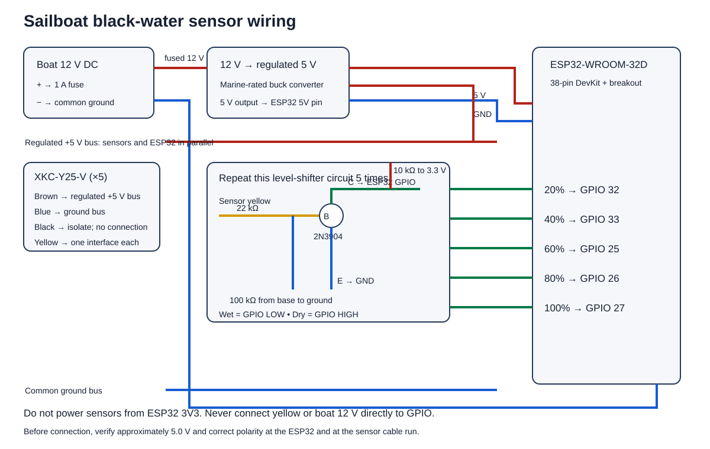

# Installation and deployment guide

This guide targets the 38-pin ESP32-WROOM-32D / ESP32 DevKit-style board in the linked Amazon kit and five XKC-Y25-V non-contact sensors. Read the whole guide before connecting boat power.



## 1. What this system does

Five external capacitive sensors are installed at chosen tank heights. The firmware reports the highest wet sensor as a ratio:

| Highest wet sensor | Signal K value | Approximate display |
|---|---:|---:|
| None | `0.0` | 0% |
| Sensor 1 | `0.2` | 20% |
| Sensor 2 | `0.4` | 40% |
| Sensor 3 | `0.6` | 60% |
| Sensor 4 | `0.8` | 80% |
| Sensor 5 | `1.0` | 100% |

Equal vertical spacing approximates volume only for a tank with a constant cross-section. For an irregular tank, place sensors at known volume points or edit `kLevelAtSensor` in `include/tank_config.h`.

The production image publishes:

- `tanks.blackWater.0.currentLevel` — official Signal K tank ratio path.
- `tanks.blackWater.0.sensors.level20` through `level100` — diagnostic wet/dry states.
- `tanks.blackWater.0.sensorPatternValid` — `false` if an upper sensor is wet while a lower sensor is dry.

An invalid pattern still reports the highest wet point. That conservative behavior avoids understating a potentially full holding tank.

## 2. Parts and tools

- One 38-pin ESP32-WROOM-32D development board with CP2102 USB interface.
- Five genuine XKC-Y25-V high/low-output non-contact sensors.
- One regulated, marine-suitable 12 V-to-5 V buck converter rated for at least 1 A continuous output.
- One 1 A inline fuse and holder, placed near the 12 V source.
- Five 2N3904 NPN transistors.
- Five 22 kΩ, five 100 kΩ, and five 10 kΩ resistors, 1/4 W or greater.
- Prototype board or a properly designed PCB, screw terminals, tinned marine wire, adhesive-lined heat-shrink, strain relief, and a splash-resistant enclosure.
- Data-capable Micro-USB cable.
- Multimeter.
- Laptop with Git and Visual Studio Code plus the PlatformIO extension, or PlatformIO Core.

The discrete transistor interface is necessary because the XKC-Y25-V yellow output rises toward its 5–24 V supply. ESP32 GPIO is not 12 V-tolerant.

## 3. Bench-wire one sensor channel

Keep boat power off while wiring.

### Sensor side

1. Connect XKC brown to fused +12 V.
2. Connect XKC blue to the 12 V negative/common ground.
3. Leave XKC black disconnected and individually insulated. With black floating, the sensor yellow wire goes high when liquid is detected.
4. Connect XKC yellow through a 22 kΩ resistor to the base of a 2N3904.
5. Connect a 100 kΩ resistor from the transistor base to common ground.
6. Connect the transistor emitter to common ground.

### ESP32 side

1. Connect the transistor collector to GPIO 32 for the lowest sensor.
2. Connect a 10 kΩ resistor from that collector/GPIO node to the ESP32 `3V3` terminal.
3. Connect an ESP32 `GND` terminal to common ground.

The interface inverts the signal: liquid present produces `LOW` at the ESP32. The firmware already accounts for this.

Repeat the same circuit for each channel:

| Tank position | Sensor yellow via its own interface | ESP32 terminal label |
|---:|---|---|
| 20% / lowest | Channel 1 collector | `IO32` |
| 40% | Channel 2 collector | `IO33` |
| 60% | Channel 3 collector | `IO25` |
| 80% | Channel 4 collector | `IO26` |
| 100% / highest | Channel 5 collector | `IO27` |

The firmware intentionally avoids GPIO 0 and GPIO 2 used in the reference project because they affect ESP32 boot behavior. It also avoids GPIO 6–11, which the module uses for flash memory.

## 4. Power arrangement

For desk testing, power the ESP32 only through Micro-USB. The sensor can use a separate 12 V bench supply, but its negative must connect to ESP32 GND for the transistor interface.

For installation aboard:

1. Run protected 12 V DC through a 1 A fuse located close to the source.
2. Split the fused output to the five brown sensor wires and the input of the 12-to-5 V buck converter.
3. Connect the buck converter's regulated 5 V output to the ESP32 `5V` terminal and its negative to ESP32 `GND`.
4. Join sensor blue wires to the common negative bus.
5. Before plugging in the ESP32, use a multimeter to confirm correct polarity and approximately 5.0 V at the converter output.

Do not feed boat 12 V into the ESP32 `5V`, `3V3`, or GPIO terminals. Do not power the board from USB and its 5 V terminal at the same time. A generic DevKit is suitable for prototyping; a permanent boat installation needs appropriate fusing, enclosure, corrosion protection, strain relief, and transient-resistant power conversion.

## 5. Download the repository

In a terminal:

```bash
git clone https://github.com/natdog83/sensesp-blackwater-monitor.git
cd sensesp-blackwater-monitor
```

## 6. Install the development tools

### Visual Studio Code method

1. Install [Visual Studio Code](https://code.visualstudio.com/).
2. In Extensions, install **PlatformIO IDE**.
3. Open the cloned repository folder.
4. Allow PlatformIO to download the ESP32 toolchain and libraries.

### Command-line method

Install [PlatformIO Core](https://docs.platformio.org/en/latest/core/installation/index.html), then verify:

```bash
pio --version
```

On Windows, the CP2102 driver may be needed if no serial port appears. Obtain it from Silicon Labs, not a third-party driver site.

## 7. Upload the hardware-test image

Connect the ESP32 with a data-capable Micro-USB cable. From the repository directory:

```bash
pio run -e esp32dev-test -t upload
pio device monitor -b 115200
```

If automatic port detection fails, list ports with `pio device list`, then add the correct `upload_port` and `monitor_port` to `platformio.ini`.

If upload stalls at `Connecting...`, hold **BOOT**, tap **EN**, release **BOOT** after dots begin, and retry. Most CP2102 boards enter download mode automatically.

### Test without sensors first

With only the ESP32 powered by USB, the monitor should show all channels `DRY` and 0%. Briefly connect each listed GPIO terminal to `GND`; after 1.5 seconds it should change to `WET`. Test the pins from lowest to highest and verify 20%, 40%, 60%, 80%, and 100%.

Do not jumper `3V3` to `GND`. Never use a 12 V wire for this dry-contact test.

### Test real sensors

1. Power one sensor and its transistor interface as described above.
2. Confirm with a multimeter that its ESP32 GPIO node never exceeds 3.3 V.
3. Hold the sensor firmly against the outside of a non-metallic water container.
4. Move the water level across the sensor and wait at least two seconds.
5. Confirm the serial output changes reliably.
6. Repeat for all five channels before installing anything on the tank.

## 8. Install and calibrate the sensors

The XKC-Y25-V is intended for non-metallic container walls. The published sensing thickness is up to 20 mm, but coatings, voids, curved surfaces, residue, nearby metal, and tank material can reduce performance. Do not assume it will work through a metal tank wall.

1. Empty and flush the tank using the vessel manufacturer's safe procedure.
2. Mark the actual desired volume thresholds. Keep the top sensor below the overfill/vent level.
3. Choose a flat, smooth area away from metal straps, baffles, plumbing, heavy residue, and the direct inflow stream.
4. Temporarily hold each sensor with removable tape and test both dry and wet states.
5. If needed, open the sensor cover and adjust sensitivity in very small steps: counterclockwise increases sensitivity; clockwise reduces it.
6. Only after testing, bond the sensor face tightly to the tank with a compatible adhesive or non-metallic bracket. Avoid air gaps.
7. Route wiring with drip loops and strain relief. Keep it away from pumps, alternator cables, ignition wiring, heat, and chafe.
8. Put the electronics in a protected enclosure outside the tank space where practical. Do not coat the ESP32 antenna, buttons, USB connector, or sensor adjustment controls.

Do not drill or modify a sewage holding tank based solely on this guide. Metal tanks require a manufacturer-approved non-metallic sensing window or a different sensing method.

## 9. Upload production firmware

Stop the serial monitor before uploading, then run:

```bash
pio test -e native
pio run -e esp32dev
pio run -e esp32dev -t upload
pio device monitor -b 115200
```

The first command tests the tank-level calculation on the computer. The next commands build, flash, and monitor the SensESP firmware.

## 10. Configure Wi-Fi and Signal K

1. On first boot, connect a phone or laptop to the Wi-Fi access point `blackwater-monitor`.
2. Use the SensESP default provisioning password `thisisfine`.
3. If the captive portal does not open, browse to `http://192.168.4.1`.
4. Configure the boat Wi-Fi client and select or enter the Signal K server.
5. In the Signal K admin interface, approve the new device access request and use a non-expiring authorization if appropriate for the vessel.
6. In Signal K's Data Browser, confirm `tanks.blackWater.0.currentLevel` and the diagnostic paths update.

The repository does not contain Wi-Fi passwords or Signal K credentials; SensESP stores provisioning data on the device.

## 11. Optional OTA updates

Perform the first upload over USB. After the device is stable on Wi-Fi, add these lines to the `[env:esp32dev]` section of `platformio.ini`, replacing the address and password with the values configured on the device:

```ini
upload_protocol = espota
upload_port = blackwater-monitor.local
upload_flags =
  --auth=YOUR_OTA_PASSWORD
```

Then upload with `pio run -e esp32dev -t upload`. Remove or comment those lines when returning to USB uploads. Do not commit an OTA password.

## 12. Troubleshooting

| Symptom | Likely cause | Check |
|---|---|---|
| No serial port | Charge-only cable or missing CP2102 driver | Try a known data cable, another port, then install the official driver |
| Upload remains at `Connecting...` | Board did not enter download mode | Use the BOOT/EN sequence above |
| Every channel reads wet | GPIOs held low, transistor pinout wrong, or wiring short | Disconnect yellow wires and inspect collector/emitter orientation |
| Every real sensor reads dry | No 12 V sensor power, no common ground, or sensitivity too low | Measure brown-to-blue voltage and GPIO node voltage |
| Wet/dry is reversed | Black MODE wire grounded or interface differs | Leave black floating and insulated; retain active-low interface |
| `sensorPatternValid` is false | Upper wet sensor with a dry sensor below | Check bonding, wiring order, residue, and sensitivity |
| Readings change while sailing | Sloshing or installation near inflow | Increase `kDebounceMs`, relocate sensors, or add physical damping |
| Sensor always detects liquid | Sensitivity too high, wet/dirty tank wall, or nearby metal | Clean/dry exterior, move away from straps, reduce sensitivity |

## 13. Changing pins or levels

Edit only `include/tank_config.h`. Keep sensor pins ordered from lowest to highest. Avoid GPIO 0, 2, 5, 12, and 15 for this project because they are ESP32 strapping pins; avoid GPIO 6–11 because they are connected to flash. Rebuild both firmware targets after any change.
